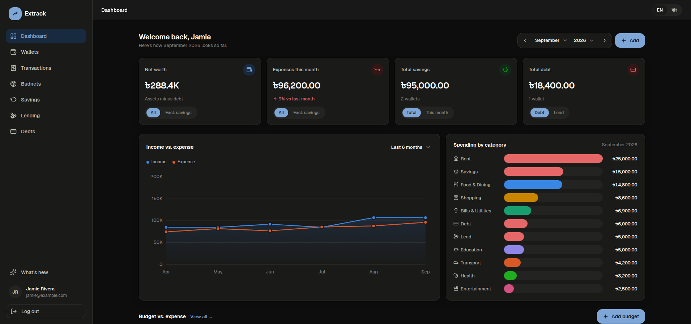
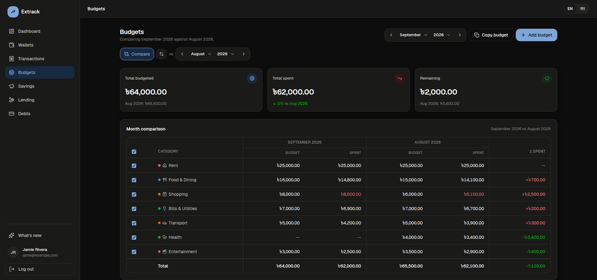
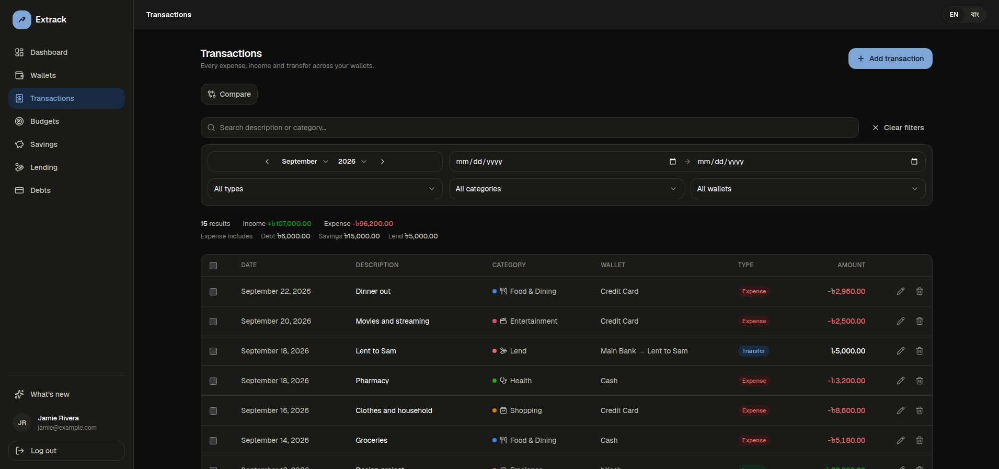
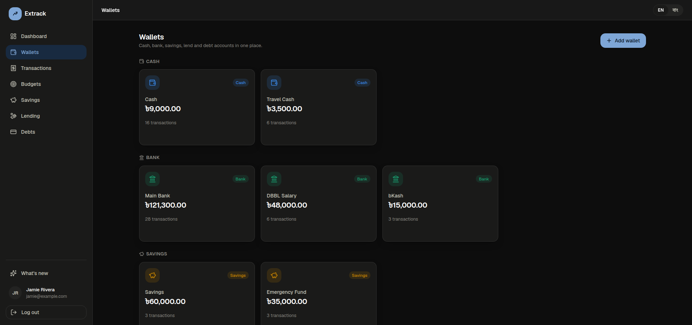
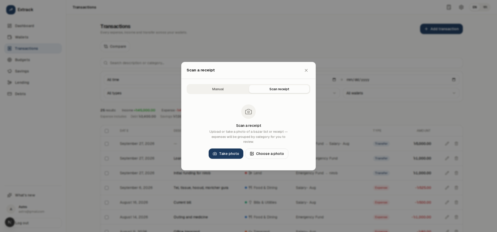
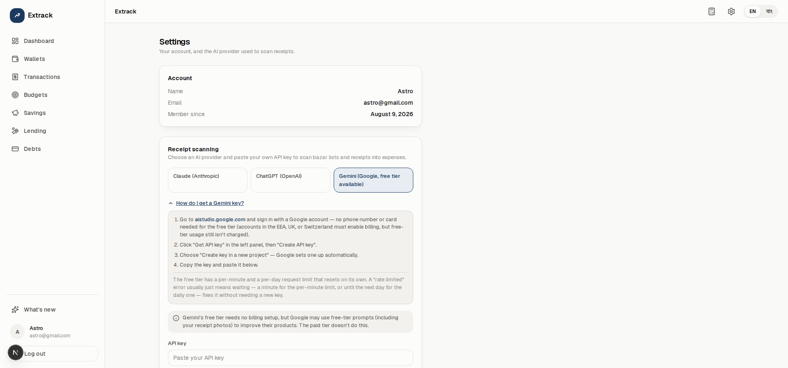
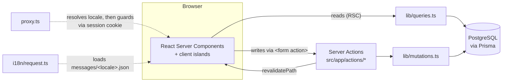

<div align="center">


# Extrack

**A full-stack personal finance tracker — cash, bank, savings and debt in one dashboard.**

Log expenses, income and transfers, budget by category, compare any two months side by side, watch net worth move over time — or just photograph a receipt and let AI turn it into categorized expenses for you.

[](https://nextjs.org)
[](https://react.dev)
[](https://www.typescriptlang.org)
[](https://www.prisma.io)
[](https://neon.tech)
[](https://tailwindcss.com)
[](https://next-intl.dev)

[Features](#features) · [Highlights](#engineering-highlights) · [Tech stack](#tech-stack) · [Getting started](#getting-started) · [Architecture](#how-it-works) · [Localization](#localization)

</div>

---

> **Note for reviewers:** the login page has a **"Try demo account"** button that fills in a read-only-in-spirit demo login — no sign-up required to look around. The **EN / বাং** toggle in the header switches the whole app to Bangla, including numerals, dates, and pluralization — not just the labels. AI receipt scanning (Settings → Receipt scanning) is bring-your-own-key by design — the demo account has none preconfigured, since that would mean spending a real API budget on behalf of anonymous visitors. Add a free [Gemini key](https://aistudio.google.com/apikey) (no billing required) to try the full flow, or read the code path starting at `src/app/api/receipts/extract/route.ts`.

## Screenshots

| Dashboard | Budgets (compare mode) |
|---|---|
|  |  |

| Transactions | Wallets |
|---|---|
|  |  |

| Scan a receipt (AI) | Settings |
|---|---|
|  |  |

## Features

### Accounts

- **Five wallet types** — Cash, Bank, Savings, Lend (money you've lent to others), Debt (credit cards / loans) — each with its own balance and currency. New wallets default to BDT (৳), formatted with Bangla numerals when the UI is in বাংলা.
- Create, rename, and delete wallets. Deleting a wallet **soft-deletes** it (history stays intact for old transactions) and only an empty wallet can be deleted.
- A debt wallet's balance means *amount owed*, not cash on hand — an expense on it increases what you owe (e.g. a card purchase), a transfer into it pays it down. The same two rules (`expense` subtracts, `income` adds, sign flipped for debt) drive every wallet, so "pay off a card" and "move money into savings" both just fall out of a transfer.
- A lend wallet is the mirror of debt: its balance is a *receivable*. Lending money picks the real wallet it comes out of (recorded as a transfer, same as funding a savings wallet); getting paid back picks the real wallet it's deposited into. It auto-archives once fully repaid, same as a cleared debt.

### Sign-in

- **Email verification.** A new email-and-password account can't sign in until it confirms its address through an emailed link (signed, single-purpose, expires in 24 hours). Accounts that existed before verification shipped are grandfathered in as verified. Unverified accounts can request a fresh link, throttled to one a minute, and a repeat signup for a never-confirmed address replaces the earlier one instead of locking its real owner out.
- **Forgot password.** A signed, single-purpose reset link (1 hour, throttled to one a minute) emailed on request — the request form answers identically whether or not the address has an account, so it can't be used to test which emails are registered, and a Google-only account (no password to reset) is silently skipped. The link is bound to the account's current password hash (the same mechanism the verification link uses), so it stops working the instant it's used or the password changes elsewhere; following it also verifies the email address, on the same "you clicked a link only the inbox owner could get" reasoning Google sign-in uses.
- **Continue with Google.** OAuth 2.0 authorization-code flow with PKCE and a one-time `state`, written from scratch (no auth library). A Google sign-in for an address that already has an account links to it — Google has verified the address — and an unverified password account claimed this way loses its password, since whoever typed the address in first may not have been its owner. The button only appears when Google credentials are configured.

### Transactions

- Three kinds: **expense**, **income**, **transfer** (wallet-to-wallet).
- Fixed category lists per kind (Food & Dining, Transport, Salary, Investment, etc.) so a category always maps to the same color in charts.
- Full CRUD with a live-updating wallet balance on every create/edit/delete, run inside a DB transaction so the balance and the transaction row never drift apart.
- **One definition of "expense", everywhere.** Paying off a debt, moving money into savings, and lending money out are stored as transfers (a wallet balance has to move) but they're money you spend, so they count as expenses. That rule lives in a single place (`isSpending` in `lib/finance.ts`, with a matching database filter beside it) and every total is built on it — dashboard cards, trend chart, spending-by-category, budgets, the Transactions summary, and the month comparison — so no two screens can disagree. The Transactions summary also breaks the Expense total down into its Debt / Savings / Lend parts.
- **Month & year filter** on every history view (Transactions, Savings, Lending, Debts, wallet detail): browse one month at a time with previous/next arrows; "Clear filters" returns to all time. It narrows the date range, so it combines with the from/to inputs.
- Server-side pagination (newest first), free-text search, and filtering by month, type, category, wallet and date range — all reflected in the URL (shareable, back-button-friendly), with a single "Clear filters" reset.
- **Month-over-month comparison** — pick any two months and see a category-by-category expense breakdown with the delta between them, swap the two months with one click.
- On mobile, filters collapse behind a toggle (with an active-filter count badge) so the page isn't dominated by empty dropdowns.

### AI receipt scanning

- Scan a photo of a bazar list or receipt — from the camera (`getUserMedia`, with a graceful fallback to the OS picker on browsers/contexts that don't support it) or an existing photo — right from the same "Add transaction" modal, as a **Manual** / **Scan receipt** tab.
- Line items are grouped by category — one expense per category present on the receipt, never one for the whole receipt and never one per line item — and the result always lands in an editable review screen (category, amount, date, note, and the underlying line items, all adjustable) before anything is written to the ledger. Nothing is auto-saved.
- **Bring your own API key.** Pick Claude, ChatGPT, or Gemini in Settings and paste your own key — there's no shared server-side key, so each user's requests run against their own account, their own usage, and their own rate limits.
- The receipt photo itself is never stored. It's base64-encoded in memory for the one extraction request and discarded immediately after — only the confirmed expense amounts you review and submit ever reach the database.

### Budgets

- Set a monthly spending limit per category and track actual spend against it, with an over-budget state that reads clearly at a glance.
- The **same month-comparison engine** as Transactions — compare this month's budget performance against any other month, side by side, with one click to swap which month is "base."
- Budget-vs-actual also surfaces on the Dashboard for the current month, so you don't have to leave the overview to see whether you're on track.

### Dashboard

- Toggleable stat cards: **Net worth** (all wallets, or excluding savings), **Expenses this month** (everything spent — including debt payoffs, savings contributions, and lending — or the same excluding money moved into savings, each with a vs.-last-month delta), **Savings** (running total, or just this month's net contribution, delta on the latter), and **Debt vs. Lend** (total owed, or total lent out) — the same segmented-toggle pattern on all four, so switching what a card shows never means leaving the dashboard.
- **Selectable trend range** for the income-vs-expense chart: last week, this month, last month, or last 6 months.
- Spending-by-category breakdown for the selected month, hand-built as inline SVG (no charting library).
- A month/year picker for browsing any period, a wallet preview (max 4, "View all" for the rest), and the 6 most recent transactions.

### Savings, Lending & Debts

- Dedicated pages that filter the wallet/transaction data down to just that type, with the same stat-card + wallet-grid + history layout as the dashboard.
- Their filter bar skips the type/category dropdowns Transactions has — every row here is already the same category, so only month, wallet, date range, and search remain.

### What's new & feature requests

- A "What's new" page lists every shipped version with a short summary of what changed, in both English and বাংলা.
- Its **Feature requests** tab is a small public roadmap: anyone signed in can suggest a feature (rate-limited to a few a day), and like the ideas they want — one like per person, toggleable, updated instantly. Requests sort by most liked or newest and carry a status (Open, Planned, In progress, Shipped, Declined) that admins set.

### Admin

- `/admin` (visible only to accounts listed in `ADMIN_EMAILS`, and only once their email is verified) shows analytics across every account: sign-ups and transactions per day, active users, verified share, sign-in methods, wallet and transaction mix, the most-used spending categories, and feature-request activity. There's a searchable users table and a feature-request moderation page (change status, delete).
- It's aggregate by design — counts and rates, never anyone's balances, transactions, or notes. Access is re-checked at every page, action and query rather than trusted from a layout, and a non-admin gets an ordinary 404.

### Settings

- Account info (name, email, member since) plus AI-provider configuration for receipt scanning, in one page.
- Per-provider step-by-step instructions for getting an API key, collapsed by default — live links to the right page on each provider's console, what billing step is required (or, for Gemini, that none is), and what a rate-limit or "no quota left" error actually means and how to fix it (wait it out vs. add funds), so a first-time user isn't left guessing.
- A user can hold a key for more than one provider at once and switch which is active without re-pasting either. Keys are write-only from the client's perspective — a saved key is never sent back to the browser, only a "connected" state.

### Design

- Custom design system: navy accent, light/dark mode (via `prefers-color-scheme`, overridable per-user), a fixed categorical color palette for charts validated for colorblind-safe contrast.
- A draggable floating calculator, one click away from a header icon on every page — its own panel, not a modal, so the rest of the app stays interactive while it's open.
- A hand-built, fully accessible `Dropdown` component (keyboard navigation, typeahead, `role="combobox"`/`listbox`) used everywhere instead of the native `<select>`, so it can be styled and positioned consistently — including correctly inside modals.
- Responsive throughout: a fixed sidebar with independently scrolling content, card grids that step from 4 → 2 → 1 columns as the screen narrows.
- Favicon and Apple touch icon are generated from the actual brand mark (`app/icon.tsx`, `apple-icon.tsx` via `next/og`) rather than a static export, so they can't drift out of sync with the logo.

### SEO

- **A real home page.** `/en` and `/bn` are a server-rendered landing page — one `h1`, a hero with a screenshot, features, how-it-works steps and an FAQ, all crawlable text in both languages — instead of a redirect to the login form. Signed-in visitors skip it and go straight to their dashboard.
- **Each page states its own canonical URL.** Public pages (home, login, signup) set a self-referencing `canonical`, `hreflang` links to both language versions plus `x-default`, and matching Open Graph / Twitter cards (`lib/seo.ts`). Nothing page-specific lives in the shared layout, which is what used to stamp every page with the home page's canonical.
- **The signed-in app is `noindex`** (set once in the `(app)` layout) and also disallowed in `robots.txt`, along with `/api/`. Lighthouse will therefore flag "Page is blocked from indexing" on `/dashboard` and the like — that's intended; audit `/en`, `/bn`, `/en/login` and `/en/signup` instead, which score 100 for SEO.
- Per-locale `sitemap.xml` (with a stable `lastmod` taken from the latest release, not "now") and `robots.txt`, both built from one `SITE_URL` (`lib/siteUrl.ts`, i.e. `APP_URL`) so the host in every canonical, alternate and sitemap entry is the exact host the site is served from — set `APP_URL` at **build** time, since these two files are generated then.
- JSON-LD `SoftwareApplication` structured data on the home page, generated per locale.

### Localization

- **Full English + বাংলা (Bangla) UI** — every page, form, table, empty state, and confirmation dialog, via locale-prefixed routes (`extrack.me/en/...`, `extrack.me/bn/...`) so each language is independently indexable and shareable. Switch languages from the compact toggle in the header; the choice is preserved across navigation.
- **Real localized formatting, not just translated strings.** Amounts render in BDT (৳) using each locale's native digits and grouping — large stat-tile values use Bangla's own লাখ/কোটি compact-number system rather than a translated "K/M." Dates render with the full localized month name in both languages ("September 24, 2026" / "২৪ সেপ্টেম্বর, ২০২৬"). Percentages and counts inside translated sentences are formatted per-locale too, not left as raw Latin digits.
- Category and wallet-type names (Food & Dining, Salary, Cash, Debt, …) are translated for display only — the underlying values stored in the database and used for business logic stay canonical English strings, so filtering, matching, and historical data are unaffected by the language the UI happens to be in.
- Pluralization goes through ICU message format (`{count, plural, one {…} other {…}}`) rather than hand-rolled `s` suffixes, which also gets the numeral formatting for free inside the plural branch.

## Engineering highlights

A few things worth pointing out if you're skimming this as a portfolio piece rather than cloning it:

- **No client-side data-fetching library, and no third-party auth library.** Every page is a React Server Component reading straight from Prisma; every write is a Server Action called from `<form action={...}>`. Auth is `scrypt` password hashing + an HMAC-signed session cookie, both written from scratch against `node:crypto`.
- **One definition of an expense.** Debt payoffs, savings contributions, and lending are stored as transfers but spent as money, so "what counts as an expense" is decided in exactly one function (`isSpending`), with its database twin (`spendingWhere`) next to it. The dashboard, charts, budgets, the Transactions summary and the month comparison all derive from it, and the summary decides per row in code rather than re-encoding the rule in SQL — there's no second copy to fall out of step.
- **Auth that fails closed.** Signed tokens are purpose-scoped (the purpose is mixed into the HMAC), so an emailed verification link, a password-reset link, or an OAuth state cookie can't be replayed as a session, or as each other; the OAuth flow uses PKCE plus a one-time `state`; verification and reset links are bound to the credentials they were issued for, so a reset link dies the moment it's used; and admin access is checked at every page, action and query — never trusted from a layout.
- **Money math that can't drift.** Wallet balances are updated inside the same DB transaction as the transaction row that caused the change — a crash or concurrent edit can't leave a balance and its history out of sync. One signed-delta formula (`expense` subtracts, `income` adds, sign flipped for debt wallets) covers all four wallet types and all three transaction kinds, including "pay off a card" and "fund savings," which are both just transfers.
- **Comparison mode as a reusable pattern, not a one-off.** The same "pick a base month, pick a compare month, swap them" interaction and URL-param shape powers budget comparison *and* category-comparison on the Transactions page — one mental model, two features.
- **Zero charting-library dependency.** The trend chart and category breakdown are hand-built inline SVG, paired with a fixed categorical color palette assigned by category position (not generated), so a category is always the same color and the palette is checked for colorblind-safe contrast.
- **Filters live in the URL**, not component state — search, month, type, category, wallet, date range, and comparison months are all query params, so every view is shareable and survives the back button.
- **Accessibility taken seriously for a solo project.** The custom `Dropdown` used everywhere implements real combobox/listbox ARIA semantics and keyboard/typeahead support instead of reaching for the native `<select>` and fighting its styling limits.
- **One `proxy.ts`, two jobs.** Locale detection/redirect (next-intl) and the auth guard run in the same request pipeline instead of two competing middlewares — a request is locale-resolved first, then checked against the session cookie using the locale-stripped path, so `/bn/wallets` and `/en/wallets` share one auth rule instead of two.
- **Bring-your-own-key, not a shared server key.** Each user's Claude/ChatGPT/Gemini API key is encrypted at rest (AES-256-GCM, `lib/apiKeyCrypto.ts`) and decrypted only server-side, at the moment of an extraction request — never sent to or stored in the browser after the initial paste. There's no app-wide `ANTHROPIC_API_KEY`-style env var; every request runs against the account that owns it, so cost and rate limits are the user's, not the app's.
- **A Route Handler, not a Server Action, for the one place that needed it.** Server Actions cap request bodies at 1MB by default — too small for a phone photo — so the receipt-upload endpoint (`api/receipts/extract`) is a plain Route Handler reading `multipart/form-data` directly, while the actual expense-creation step that follows (numbers and strings only, no image) stays on the ordinary Server Action pattern used everywhere else.
- **Provider errors, classified by what actually discriminates them, not by what looks like it should.** OpenAI returns the identical HTTP 429 for a genuine short-term rate limit and for a key with zero billing credit — telling a user to "wait and retry" on the second case is actively wrong, since no amount of waiting adds credit to a key. The fix reads `error.type` (not the more obvious but unreliable `error.code`, which varies per failure reason under the same type) to tell them apart, paired with a couple of short, `Retry-After`-aware retries for the case that's actually transient.
- **Formatting depth over string-swapping.** Bangla localization goes further than translated labels: currency, dates, and ICU plural/number interpolation all resolve through `Intl` for the active locale, and a naive month-name truncation for chart labels (`"Sep"` from slicing) was caught and replaced because slicing Bangla script mid-conjunct produces broken-looking text — the kind of bug that's invisible if you only ever test in English.

## Tech stack

| | |
|---|---|
| Framework | [Next.js](https://nextjs.org) 16 (App Router, Server Actions, Turbopack) |
| UI | React 19, TypeScript, Tailwind CSS v4 |
| Icons | [lucide-react](https://lucide.dev) |
| Database | PostgreSQL via [Prisma](https://www.prisma.io) ORM |
| Auth | Custom cookie session — HMAC-signed (`node:crypto`), password hashing via `scrypt`, hand-rolled Google OAuth (PKCE), and emailed verification / password-reset links — no third-party auth library |
| Email | [Resend](https://resend.com) over plain `fetch` (no SDK) |
| AI receipt scanning | Bring-your-own-key — [`@anthropic-ai/sdk`](https://www.npmjs.com/package/@anthropic-ai/sdk), [`openai`](https://www.npmjs.com/package/openai), [`@google/genai`](https://www.npmjs.com/package/@google/genai) — keys encrypted at rest, no app-wide provider key |
| i18n | [next-intl](https://next-intl.dev) — locale-prefixed routing, ICU messages, `Intl`-backed number/date formatting |

## Getting started

### Prerequisites

- Node.js 20+
- A PostgreSQL database. This project is built and tested against [Neon](https://neon.tech)'s serverless Postgres, but any Postgres instance works.

### 1. Clone and install

```bash
git clone https://github.com/Shazzadul-Shakib/extrack.git
cd extrack
npm install
```

`npm install` also runs `prisma generate` automatically (via `postinstall`), so the Prisma Client is ready right after.

### 2. Configure environment variables

Copy the example file and fill it in:

```bash
cp .env.example .env
```

| Variable | Required | Description |
|---|---|---|
| `DATABASE_URL` | Yes | Postgres connection string. If you're on Neon, use the **pooled** connection string (the one with `-pooler` in the hostname) — it's built for many short-lived serverless connections. |
| `SESSION_SECRET` | Yes | Signs session cookies and email-verification links. Generate one with `openssl rand -hex 32`. There's no fallback — the app won't sign a session without it. |
| `APP_URL` | Production | Public origin (e.g. `https://www.extrack.me`) — the exact host you serve the site from, `www.` or not. Emailed links, the Google redirect URI, and every canonical URL / sitemap entry are built from it. Must be set at build time as well as runtime. Never inferred from the request in production. Falls back to Vercel's production-URL variable; defaults to the request host in local dev. |
| `RESEND_API_KEY`, `EMAIL_FROM` | For email sign-up | [Resend](https://resend.com) credentials for verification emails; `EMAIL_FROM` must be on a domain you've verified there. With no key, dev prints the verification link to the server console; production can't send email. |
| `GOOGLE_CLIENT_ID`, `GOOGLE_CLIENT_SECRET` | Optional | Enables "Continue with Google". Add `{APP_URL}/api/auth/google/callback` as an authorized redirect URI on the OAuth client. |
| `ADMIN_EMAILS` | Optional | Comma-separated emails allowed into `/admin`. Empty disables the admin area. |
| `API_KEY_ENCRYPTION_KEY` | For receipt scanning | Encrypts each user's pasted Claude/ChatGPT/Gemini API key at rest (AES-256-GCM). Generate with `openssl rand -hex 32`. Not the same kind of secret as the others — there's no app-wide provider key; each user brings and stores their own, encrypted with this. |

### 3. Set up the database

Push the Prisma schema to your database:

```bash
npm run db:push
```

(This project manages its schema with `prisma db push` rather than versioned migrations — there's no `prisma/migrations` folder. Use `npm run db:migrate` instead if you'd rather switch to a migration-based workflow.)

When upgrading an existing database to the release that added email verification and Google sign-in, `db push` warns about adding a unique constraint (on the new, all-null `google_id` column) and asks for `--accept-data-loss`. Nothing is lost — it's a generic warning for that kind of change. Every existing user is marked email-verified automatically when the new column is added.

### 4. Run the dev server

```bash
npm run dev
```

Open [http://localhost:3000](http://localhost:3000) — you'll be redirected to `/en/login` (or `/bn/login` based on your browser's language). Use "Create an account" to sign up (a new account starts with four default wallets: Cash, Main Bank, Savings, Credit Card, all in BDT) and confirm your email address to sign in, or click **"Try demo account"** to explore with existing data — no email step. Switch languages any time from the toggle in the header — no extra setup or environment variables needed.

With no `RESEND_API_KEY` set, signing up in dev prints the verification link in the terminal running `npm run dev`, so you can finish the flow locally without any email service.

### 5. Optional: real email, Google sign-in, AI receipt scanning, and the admin area

**Verification emails (Resend).** Create an API key at [resend.com/api-keys](https://resend.com/api-keys) and set `RESEND_API_KEY`. A new Resend account is in test mode: it only delivers to the email address that owns the account, and rejects everyone else with a `403 … You can only send testing emails to your own email address` (logged as `[email] Resend rejected the message`, and the signup screen says the email couldn't be sent). To email real users, verify a domain at [resend.com/domains](https://resend.com/domains) and set `EMAIL_FROM="Extrack <no-reply@yourdomain.com>"`. Restart the dev server after editing `.env`.

**Continue with Google.** In the [Google Cloud console](https://console.cloud.google.com/apis/credentials), configure the OAuth consent screen (while it's in Testing mode, add your own account as a test user) and create an OAuth client ID of type *Web application*. Add `http://localhost:3000/api/auth/google/callback` — and the production equivalent — as authorized redirect URIs, then set `GOOGLE_CLIENT_ID` and `GOOGLE_CLIENT_SECRET`. The button appears on the login and signup pages once both are set. If you set `APP_URL`, it must match the origin you're browsing (`http://localhost:3000` locally), because the redirect URI is built from it.

**AI receipt scanning.** Set `API_KEY_ENCRYPTION_KEY` (`openssl rand -hex 32`) — this is the only server-side setup required. There's no app-wide Claude/ChatGPT/Gemini key to configure: each signed-in user pastes their own from Settings → Receipt scanning, which has step-by-step instructions built in for getting one from each provider. Gemini's is the one genuinely free option (no billing needed); Claude and ChatGPT both require the user to add billing on their own account before a key will work at all.

**Admin.** Put your own email in `ADMIN_EMAILS` (comma-separated for several). That account, once its email is verified, gets an **Admin** link in the sidebar. Nobody else can reach `/admin` — there's no in-app way to grant the role.

## Available scripts

| Script | What it does |
|---|---|
| `npm run dev` | Start the dev server (Turbopack) |
| `npm run build` | Production build |
| `npm run start` | Serve the production build |
| `npm run lint` | ESLint |
| `npm run db:generate` | Regenerate the Prisma Client |
| `npm run db:push` | Push `schema.prisma` to the database (no migration history) |
| `npm run db:migrate` | Create/apply a dev migration |
| `npm run db:deploy` | Apply pending migrations (production) |
| `npm run db:studio` | Open Prisma Studio (a GUI for your database) |

## Project structure

```
src/
  app/
    [locale]/              # everything below is locale-prefixed: /en/..., /bn/...
      (auth)/               # /login, /signup, /forgot-password, /reset-password — unauthenticated layout
      (app)/                # /dashboard, /wallets, /transactions, /budgets, /savings, /lend, /debts, /updates, /settings
        admin/              # /admin, /admin/users, /admin/feature-requests — admin-only analytics + moderation
    api/auth/               # Route handlers: google (start), google/callback, verify-email (emailed link)
    api/receipts/           # Route handler: extract (multipart image upload → grouped expense JSON)
      layout.tsx            # root <html lang>, NextIntlClientProvider, per-locale metadata
    actions/                # Server Actions (auth.ts, wallets.ts, transactions.ts, budgets.ts, features.ts, settings.ts, receipts.ts) — all writes go through these
    robots.ts, sitemap.ts   # locale-aware robots.txt / sitemap.xml (hreflang alternates per page)
    icon.tsx, apple-icon.tsx # favicon generated from the brand mark via next/og's ImageResponse
  i18n/
    routing.ts              # locales (en, bn), default locale, prefix mode
    navigation.ts           # locale-aware Link/redirect/useRouter/usePathname (wraps next/navigation)
    request.ts              # resolves the active locale + loads its message file per request
  components/
    ui.tsx                  # Button, Input, Select, Field, Card, Badge, EmptyState — the shared component kit
    Dropdown.tsx             # Custom accessible dropdown (used as `Select` everywhere)
    LanguageSwitcher.tsx     # Compact EN/বাং sliding toggle, in the app header
    dashboard/               # Stat cards (incl. toggleable), charts, month/trend-range pickers
    transactions/            # Transaction form, receipt-scan flow, table, filters, month-comparison table
    budgets/                 # Budget form/table, progress chart, month-comparison table + toggle
    wallets/                 # Wallet cards, forms
    settings/                # LLM provider/API-key form, with the built-in get-a-key instructions
    calculator/              # Draggable floating calculator
    shell/                   # Sidebar / app shell
  lib/
    db.ts                    # Prisma client singleton + retry logic for transient connection errors
    session.ts               # Cookie session read/write, requireUser()/requireAdmin()/getCurrentUser()
    emailVerification.ts, passwordReset.ts, email.ts, google.ts, googleAccount.ts   # Verification & reset links, Resend sender, Google OAuth
    roles.ts, admin.ts       # ADMIN_EMAILS check; admin-only aggregate analytics queries
    features.ts              # Feature requests + likes
    crypto.ts                # Password hashing (scrypt) + session token signing (HMAC) — one-way only
    apiKeyCrypto.ts          # Reversible AES-256-GCM encrypt/decrypt for user-pasted provider API keys
    receiptImage.ts          # Client-side canvas re-encode (HEIC → JPEG, size cap) before upload
    llm/                     # Provider-agnostic receipt extraction: anthropic.ts, openai.ts, google.ts,
                            #   index.ts (dispatch), prompt.ts, parse.ts (untrusted-output validation), retry.ts
    users.ts, queries.ts, mutations.ts   # Data access layer (incl. paginated transaction queries)
    finance.ts               # Wallet balance math, net worth, the one `isSpending` definition of an expense, monthly aggregation, budget & category comparisons
    format.ts                # Locale-aware currency/date/number formatting (Intl-backed, not string-swapping)
    transactionFilters.ts    # URL search-param parsing (search, month, type, category, wallet, date range)
    categories.ts            # Fixed category lists (canonical English) + chart color slot assignment
  proxy.ts                  # Next.js 16's renamed `middleware.ts` — resolves the locale (next-intl) first,
                            # then guards the route using the locale-stripped path against the session cookie
messages/
  en.json, bn.json           # UI strings by namespace, ICU message format (plurals, rich text)
prisma/
  schema.prisma              # User, Wallet, Transaction, Budget, FeatureRequest, FeatureVote, UserSettings models
```

## How it works



**Rendering**: pages are React Server Components that fetch data directly via Prisma (`lib/queries.ts`) — no client-side data-fetching library. All writes (create/update/delete wallet, transaction, or budget; auth) go through Server Actions in `src/app/actions/`, called directly from `<form action={...}>` and revalidating the affected routes on success.

**Auth**: there's no auth library. Signing up hashes the password with `scrypt` and a random salt (`lib/crypto.ts`) and emails a verification link; logging in (once verified) issues an HMAC-signed, `httpOnly` cookie (`lib/session.ts`) containing the user id and an expiry. Signed tokens can be scoped to a purpose, which is mixed into the signature, so a verification link or OAuth state cookie can never be replayed as a session. `src/proxy.ts` checks that cookie on every request and redirects accordingly. `getCurrentUser()` is wrapped in React's `cache()` so it only reads the cookie/DB once per request even if called from multiple components.

**Localization**: every route lives under `app/[locale]/`, so `requireUser()`'s redirects and every internal `<Link>` go through the locale-aware helpers in `i18n/navigation.ts` rather than plain `next/navigation` — otherwise a redirect from a Bangla page would silently drop the user back into English. `proxy.ts` resolves the locale for a request first (next-intl), then runs the auth check against the locale-stripped path, so both languages share one set of protected-route rules. UI strings live in `messages/en.json` / `messages/bn.json` as ICU messages (plurals, rich text for bold spans inside a sentence); `lib/format.ts` wraps `Intl` for currency, dates, and plain numbers so Bangla gets its own digits, month names, and large-number units (লাখ/কোটি) rather than a translated label glued onto English-formatted numbers. Category and wallet-type values stay canonical English in the database — translation happens only at the display layer, via a lookup keyed by that canonical value.

**Database**: `lib/db.ts` builds one Prisma Client, cached on `globalThis` so Next's dev-mode hot reload doesn't leak a new connection pool on every save, with automatic retry on transient connection errors (useful with Neon's serverless Postgres, which can cold-start). Money amounts are stored as `Decimal(14,2)` and converted to plain `number` at the data-access boundary.

**Comparisons**: Budgets and Transactions both support a "base month vs. compare month" view driven by the same `compare` / `cy` / `cm` URL params and the same swap interaction, backed by `compareBudgetProgress()` and `compareCategoryTotals()` in `lib/finance.ts`.

**AI receipt scanning**: the one deliberate departure from "everything is a Server Action." A photo goes to a plain Route Handler (`api/receipts/extract`) — Server Actions cap request bodies at 1MB, too small for a phone photo — which decrypts the signed-in user's stored key (`apiKeyCrypto.ts`, AES-256-GCM), calls the matching provider module under `lib/llm/` (one shared prompt, one shared untrusted-output parser, a provider-specific error classifier), and returns the grouped result. The image is never written to disk or the database; the route holds it in memory for that one request only. Nothing reaches `transactions` until the user reviews and submits the result through an ordinary Server Action, same as every other write in the app.

**Styling**: Tailwind v4 with the design system expressed as CSS custom properties in `globals.css` (colors, radius scale, shadows), so light/dark mode is a matter of swapping variable values rather than duplicating classes.

## Deploying

This app deploys cleanly to Vercel (or any Node.js host). Set `DATABASE_URL` and `SESSION_SECRET` in your platform's environment variables — both are required, there's no fallback for either — plus `APP_URL` (and `RESEND_API_KEY` / `EMAIL_FROM`, so sign-up emails can go out). If you're deploying to a platform that runs multiple instances of your app (Vercel included), `SESSION_SECRET` **must** be the same fixed value across all of them, since it's what lets one instance verify a session token signed by another. The same applies to `API_KEY_ENCRYPTION_KEY` if you want AI receipt scanning available: it must be set (and, again, identical across every instance) before deploying, since it's what makes previously-saved user API keys decryptable — rotating it without a migration plan locks out every key already stored.
